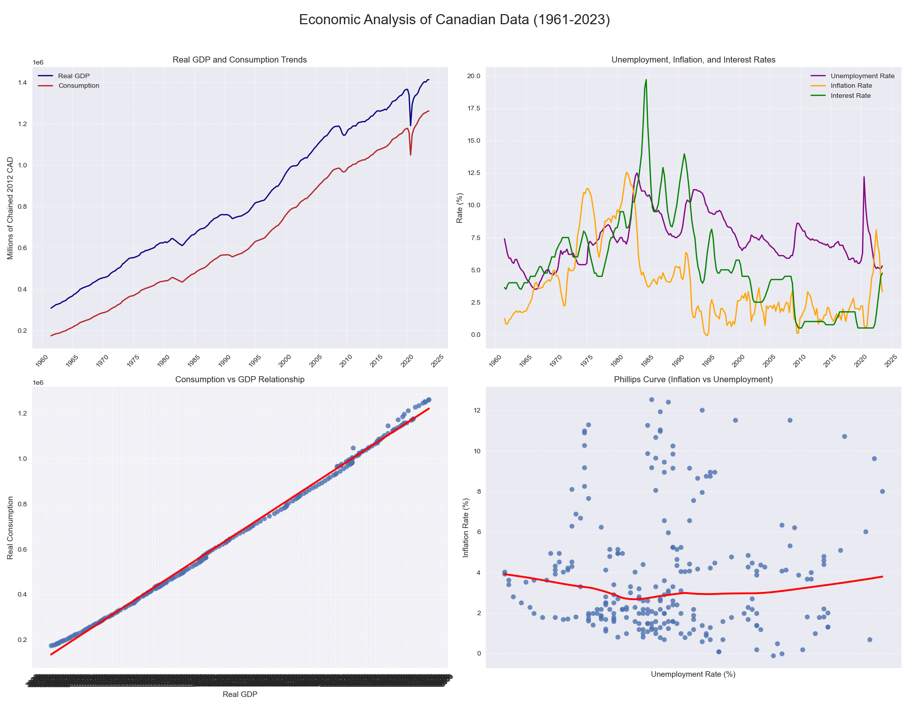

# Canadian Macroeconomic Analysis & Forecasting (1961-2023)

## Project Overview

This project provides a comprehensive, end-to-end analysis of the Canadian economy using over 60 years of quarterly data. The goal was to build a robust data pipeline in Python to clean, analyze, and model key macroeconomic indicators. The analysis uncovers the primary drivers of consumer spending, develops a high-performance time-series model to forecast future GDP, and calculates key economic metrics like the Marginal Propensity to Consume (MPC) and the Okun's Law coefficient.

The project demonstrates a full data science workflow, from data sourcing and cleaning to advanced modeling and interpretation of results.



---

## Key Features

- **Data Processing**: A robust pipeline that loads, validates, and cleans the dataset, including feature engineering for growth rate calculation.
- **Exploratory Data Analysis (EDA)**: A 2x2 dashboard of visualizations is generated to provide insights into economic trends and relationships.
- **Time-Series Forecasting**:
  - Rigorously evaluates multiple models (Naive, Exponential Smoothing, ARIMA) on a train-test split of the data.
  - The **ARIMA model proved most effective**, reducing forecast error (RMSE) by **68.75%** compared to the baseline.
- **Machine Learning Analysis**:
  - A multiple linear regression model explains **99.8% of the variance** in consumer spending (R²=0.9981).
  - A Random Forest model identifies **Real GDP (`Value`)** as the primary driver of consumption, with over 99% feature importance.
- **Economic Theory Application**: The analysis connects to established economic principles by calculating a realistic **Okun's Law Coefficient (-0.387)** and a **Marginal Propensity to Consume (0.982)**.
- **Automated Reporting**: The script automatically saves all plots and exports a detailed, multi-sheet Excel report of the findings.

---

## Data Source

The project uses a clean dataset of quarterly data from 1961 to 2023, sourced from reliable public databases like the St. Louis Federal Reserve (FRED) and Statistics Canada.

The dataset (`Canada_Economic_Data_1961-2023.csv`) includes:
- **`date`**: Quarter-end date
- **`Value`**: Real Gross Domestic Product (GDP)
- **`consumption_expenditure`**: Real Personal Consumption Expenditures
- **`unemployment`**: Quarterly Unemployment Rate
- **`Inflation`**: Year-over-year inflation rate
- **`interest_rate`**: Bank of Canada Policy Interest Rate

---

## Technologies & Libraries

- Python 3.x
- pandas
- scikit-learn
- statsmodels
- pmdarima
- matplotlib & seaborn
- openpyxl

---

## How to Run

1.  **Clone the repository:**
    ```bash
    git clone https://github.com/Priyansh-Jajoo/Canadian-GDP-analysis-python.git
    cd Canadian-GDP-analysis-python
    ```

2.  **Install the required libraries:**
    ```bash
    pip install pandas numpy matplotlib seaborn statsmodels pmdarima scikit-learn openpyxl
    ```

3.  **Run the script:**
    Ensure the `Canada_Economic_Data_1961-2023.csv` file is in the same directory and execute the script from your terminal.
    ```bash
    # Replace with your Python script's name
    Canada_GDP_Python.py
    ```

---

## Summary of Results

The final analysis produced clear and credible insights into the Canadian economy.

#### Forecasting Performance
The ARIMA model was the best performer for forecasting future GDP, based on having the lowest Root Mean Squared Error (RMSE).

| Model                 | RMSE      | Improvement over Baseline (%) |
| :-------------------- | :-------- | :---------------------------- |
| Naive                 | 123371.72 | -                             |
| Exponential Smoothing | 88314.52  | 28.42%                        |
| **ARIMA** | **38551.22** | **68.75%** |

#### Key Economic Drivers
- **Primary Driver:** Real GDP (`Value`) was identified as the most significant driver of consumer spending (>99% importance).
- **Model Fit:** The multiple regression model explained 99.8% of the variance in consumption.
- **Key Metrics:**
  - Marginal Propensity to Consume (MPC): **0.982**
  - Okun's Law Coefficient: **-0.387**
